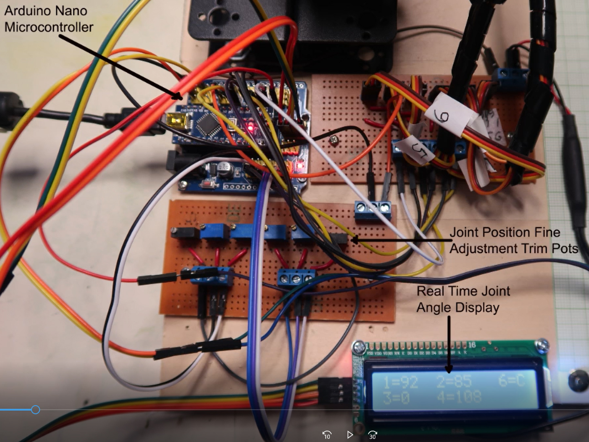

# 6 Degrees of Freedom Robot Arm

* The power system consists of 6 servo motors
* All bracket fittings are made of 2mm thick aluminum plate
* Imported cup bearings are used at the steering joints

## Servo Specification:
* Model: MG996R analog steering gear
* Working voltage: 4.8V-7.2V
* No-load current: 100mA
* Machine torsion: 10kg.cm
* Limit angle: 180°
* Gear material: Metal gear
* The Servos require a separate 5 V power supply rated at 2 amps

## Assembly of mechanical structure
The kit comes without instructions. A very good video to support assemble can be found at https://www.youtube.com/watch?v=hTZ2z_C9dSU
The servos must be supplied with a separate 5VDC power supply rated at 2 amps.
## Important Considerations for Coding

An important feature of the code is a method to reduce the speed that the arm transitions from original destination to final destination.
The method involves creating a function that moves the arm from the initial position to the final position in 1 degree increments or decrements. This eliminates the large interia that would result in the arm moving between positions at maximum speed resulting in stress on the metal gears.

## IR Control

  * **Red Power Button** – sets arm to Home position
  * **ST/RPT** Resets all stop execute functions
  * **0** starts a complete tower build sequence
  * **1** starts a Home to Position 1 to Home sequence
  * **2** starts a Home to Position 2 to Home sequence
  * **3** starts a Home to Position 3 to Home sequence
  * **4** starts a Home to Position 4 to Home sequence
  * **5** starts a Home to Position 5 to Home sequence
  * **6** starts a Home to Position 5 level 2 to Home sequence
  * **7** starts a Home to Position 5 level 3 to Home sequence
  * **8** starts a Home to Position 5 level 4 to Home sequence

The IR control allows selecting 9 different Robot Arm operations. 
Selecting "0" start 1 complete 4 block tower building operations.
Selecting "1" starts a single Arm movement from Home position to Position 1, and then back to Home.
Similarly selecting "1" through "8" will start a single Arm movement to posiitons 2 through 5-level-4 Positions.
To start another another sequence requires resetting the stop execute function. This is done by depressing the ST/RPT button.

## Electronic System Components

## Joint Angle Display

The Joint angles are identified 1 through 6. Angles for Joints 1 through 5 are in degrees (0 to 180) while the end effector Joint 6 is either O for open or C for Closed. Joint 5 and Joint 1 angles are both located at row/column 0/0 and will override each other. Thses angles are updated at the beginning of the joint travel and the end of joint travel.

## Joint Fine Adjustment - 6 Trim Potentiometeres
The angles for each of the joints can be set using the 6 trim pots. The wiper voltages of the trim pots are fed to 6 A/D converter inputs. Under normal operation, in the loop, this function is commented out. When using this feature the normal operation of the looping code is commented out.

#### Schematic Diagram

